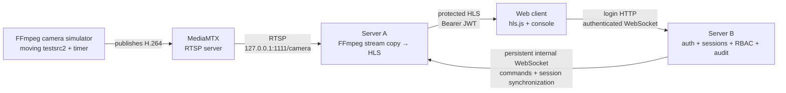
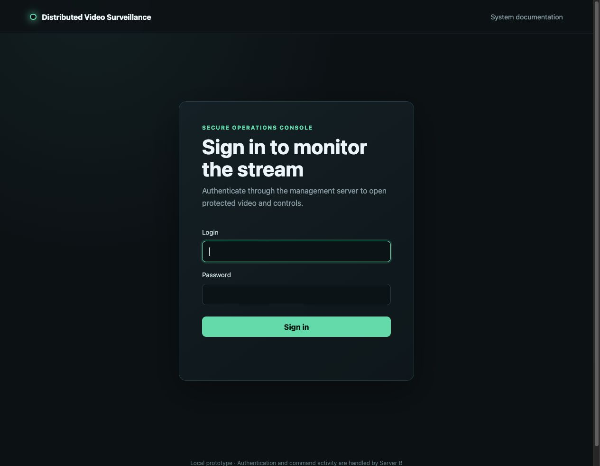
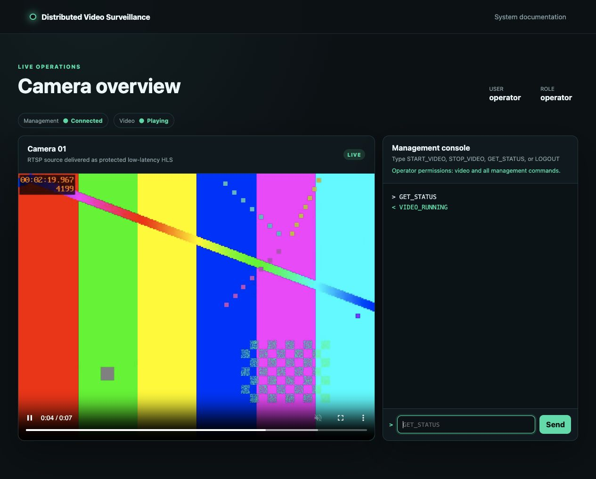
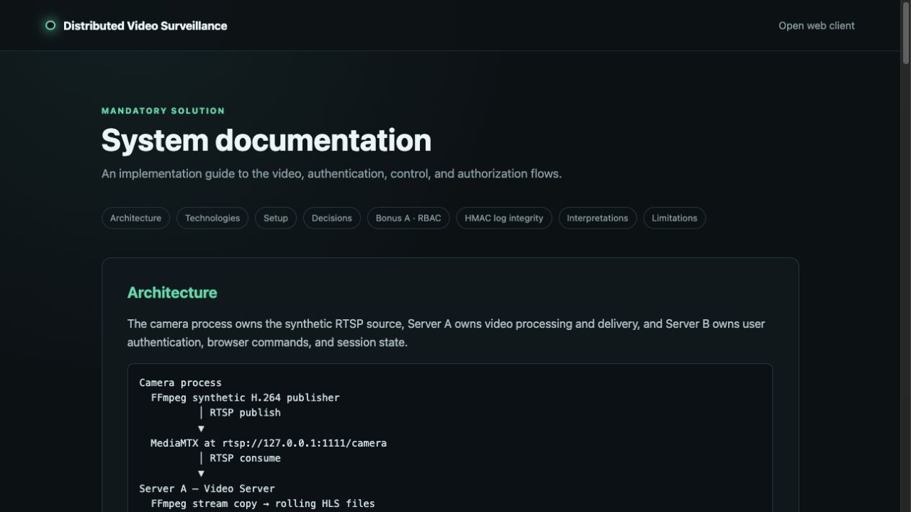

# Distributed Video Surveillance System

This project simulates a small distributed video-surveillance platform. A fake camera generates a moving video stream, one server processes and protects that video, another server handles users and commands, and a browser provides the operator interface.

The implementation uses JavaScript and CommonJS on Node.js. It was developed and runtime-tested on macOS Apple Silicon and is designed to run without source changes on Windows 11 x64.

## Quick start

This short path is for an experienced reviewer. New users should continue to [Complete setup and usage](#complete-setup-and-usage).

```sh
npm install
cp .env.example .env
npm run create-users
```

Replace the three secret placeholders in `.env`, then start one component per terminal:

```sh
# Terminal 1
npm run start:camera
```

```sh
# Terminal 2
npm run start:server-a
```

```sh
# Terminal 3
npm run start:server-b
```

Open [http://127.0.0.1:3002/](http://127.0.0.1:3002/) and sign in with `operator` / `operator123`.

## What this system does

The system separates video production, video delivery, and user management:

- FFmpeg acts as a fake camera and generates a moving test pattern with an elapsed-time display.
- MediaMTX accepts that camera feed and exposes it at the required RTSP address.
- Server A reads RTSP, repackages H.264 as HLS, serves protected video, and owns the global running/stopped delivery state.
- The browser uses hls.js to play HLS while attaching authorization to every playlist and segment request.
- Server B handles users, login, JWTs, sessions, RBAC, browser commands, and the integrity-protected command log.
- Server B controls Server A through a persistent WebSocket rather than REST.
- Server A independently verifies video authorization, so knowing the playlist URL is not enough to watch video.



Detailed architectural reasoning is in [SOLUTION.md](SOLUTION.md). The running application also serves documentation at [http://127.0.0.1:3002/docs](http://127.0.0.1:3002/docs).

## Components

### Camera simulator

The camera process starts and supervises two child processes:

- **FFmpeg** uses its `testsrc2` source to generate 640×480, 30 fps H.264 video. The pattern moves continuously and includes a changing elapsed-time display, making frozen frames and approximate latency easy to notice.
- **MediaMTX** receives FFmpeg's published stream and makes it available to RTSP clients.

The supervisor gives each process a bounded restart delay. If FFmpeg or MediaMTX exits unexpectedly, it is restarted without requiring the Node process to be restarted.

### MediaMTX

MediaMTX is a small media server. Here it provides the RTSP meeting point between the fake camera publisher and Server A. It listens locally at:

```text
rtsp://127.0.0.1:1111/camera
```

FFmpeg publishes to that URL, and Server A independently consumes from it.

### Server A — video server

Server A:

- starts a supervised FFmpeg process that reads the RTSP camera over TCP;
- stream-copies the existing H.264 video into rolling HLS playlist and segment files;
- serves protected HLS under `/video/`;
- owns the global `videoRunning` delivery flag;
- handles `START_VIDEO`, `STOP_VIDEO`, and `GET_STATUS`;
- receives commands over the internal WebSocket;
- verifies JWT signatures and claims itself;
- checks each JWT's `jti` against its synchronized active-session registry;
- fails video authorization closed while session synchronization is unavailable.

`STOP_VIDEO` changes delivery state only. It deliberately does not stop the source, either FFmpeg process, MediaMTX, or HLS generation.

### Server B — authorization and management server

Server B:

- reads users from `server-b/users.json`;
- compares submitted passwords with stored bcrypt hashes;
- creates in-memory sessions and one-hour JWTs;
- exposes `POST /auth/login` and protected `GET /protected`;
- authenticates the browser WebSocket;
- rechecks the active session before every command;
- enforces viewer/operator RBAC before forwarding;
- maintains one reconnecting internal WebSocket to Server A;
- synchronizes active, added, and revoked sessions;
- serves the frontend and `/docs`;
- appends command-processing events to `commands.log`;
- protects that NDJSON log with a serialized HMAC-SHA256 chain.

### Web client

The browser client provides:

- a login form;
- current user, role, management connection, and video status;
- authenticated hls.js playback;
- a text command console and correlated response history;
- safe handling for stopped video, authorization errors, server outages, and timeouts;
- logout cleanup that destroys the player, closes the WebSocket, and clears the in-memory JWT.

It does not save the JWT in `localStorage` or `sessionStorage`.

## Complete data flows

### Video flow

1. Camera FFmpeg generates the moving `testsrc2` video and encodes it as H.264.
2. FFmpeg publishes H.264 to MediaMTX.
3. MediaMTX exposes the stream through RTSP.
4. Server A's FFmpeg reads that RTSP stream over TCP.
5. Because the source is already H.264, Server A stream-copies it into HLS instead of re-encoding it.
6. FFmpeg writes a rolling `stream.m3u8` playlist and `.ts` segments into `runtime/hls/`.
7. Server A serves those files through protected HTTP routes.
8. hls.js requests the playlist and every segment with the user's Bearer JWT.
9. The browser decodes and displays the live video.

### Authentication flow

1. The browser submits login and password to `POST /auth/login` on Server B.
2. Server B finds the login in `server-b/users.json`.
3. `bcrypt.compare` checks the submitted password against the stored hash.
4. Server B creates an in-memory session with a unique `jti` identifier.
5. It issues a signed JWT containing the login, role, `jti`, issue time, and one-hour expiration.
6. The new session is synchronized to Server A when the internal connection is available.
7. The browser keeps the JWT only in JavaScript memory.

### Control flow

1. The browser sends a command and UUID `requestId` over its authenticated WebSocket.
2. Server B rechecks the session and validates the message.
3. Server B applies RBAC using the verified session role.
4. Command receipt and processing state are written to the HMAC-chained audit log.
5. Allowed video commands are forwarded over the persistent Server B-to-A WebSocket.
6. Server A validates the command and reads or changes `videoRunning`.
7. Server A returns a response with its internal correlation ID.
8. Server B maps the result back to the browser's original `requestId` and records the outcome.
9. The browser displays a readable response in the command history.

### Video authorization flow

For every HLS playlist or segment request:

1. hls.js adds `Authorization: Bearer <JWT>`.
2. Server A verifies the HS256 signature and expiration.
3. Server A checks required claim types: `sub`, `role`, `jti`, `iat`, and `exp`.
4. Server A verifies that the `jti`, login, and role match an active synchronized session.
5. Server A checks `videoRunning`.
6. If all checks pass, the playlist or segment is served.

An invalid or inactive token returns HTTP 401. Unsynchronized authorization state or deliberately stopped delivery returns HTTP 503 with a safe explanation.

### Logout flow

1. The browser sends `LOGOUT` through its authenticated WebSocket.
2. Server B revokes that session's `jti` locally.
3. Server B sends `SESSION_REVOKE` to Server A when connected.
4. Server A removes the session from its registry.
5. Further HLS requests with the old token become unauthorized immediately.
6. Server B sends the final logout response and closes the WebSocket.
7. The frontend destroys hls.js, clears the video and in-memory token, and returns to login.

If Server A is temporarily offline during logout, the revoked session is absent from the next full `SESSION_SYNC`, so it does not become valid again.

## Complete setup and usage

### 1. Prerequisites

You need:

- Node.js LTS 22 or newer;
- npm, included with Node.js;
- FFmpeg with H.264 encoding support;
- MediaMTX.

No Docker, database, C++ compiler, or frontend build tool is required.

#### macOS Apple Silicon

Install [Homebrew](https://brew.sh/) if it is not already available, then run:

```sh
brew install ffmpeg
brew install mediamtx
```

Homebrew selects the Apple Silicon packages on an M-series Mac. The application uses executable names from `PATH`; it does not depend on Homebrew's installation directory.

#### Windows 11 x64

1. Install the current Node.js LTS x64 release from [nodejs.org](https://nodejs.org/).
2. Open the [official FFmpeg download page](https://ffmpeg.org/download.html), follow one of its Windows build links, and extract an x64 build.
3. Download the Windows AMD64 standalone archive from the [MediaMTX releases page](https://github.com/bluenviron/mediamtx/releases), then extract it.
4. Either add the FFmpeg `bin` folder and MediaMTX folder to `PATH`, or set `FFMPEG_PATH` and `MEDIAMTX_PATH` to their full executable paths in `.env`.

Example `.env` values when the tools are not on `PATH`:

```dotenv
FFMPEG_PATH=C:\Tools\FFmpeg\bin\ffmpeg.exe
MEDIAMTX_PATH=C:\Tools\MediaMTX\mediamtx.exe
```

Those are generic examples only. Use the folders where you extracted the tools. Paths containing spaces are supported because Node starts processes without a shell.

Actual runtime validation has been performed on macOS Apple Silicon. Windows 11 x64 portability has been source-reviewed but still needs confirmation on a Windows host.

### 2. Verify tool installation

Run these in Terminal, PowerShell, or Command Prompt:

```sh
node --version
npm --version
ffmpeg -version
mediamtx --version
```

Success means every command prints version information rather than “command not found” or “not recognized.” Node should report version 22 or newer. If FFmpeg or MediaMTX is configured only with an absolute `.env` path, the bare version command may fail; run the full executable path instead.

### 3. Install the project

The repository URL depends on where the submission is hosted. Replace the placeholder below:

```sh
git clone <repository-url>
cd distributed-video-surveillance
npm install
```

For a reproducible installation from the committed lockfile, `npm ci` may be used instead of `npm install`.

### 4. Configure the environment

On macOS, Linux, or Git Bash:

```sh
cp .env.example .env
```

On Windows PowerShell:

```powershell
Copy-Item .env.example .env
```

Open `.env` in a text editor. Do not commit this file.

| Variable | Meaning | Development example | Sensitive? |
| --- | --- | --- | --- |
| `FFMPEG_PATH` | Executable name on `PATH`, or full path to FFmpeg | `ffmpeg` | No |
| `MEDIAMTX_PATH` | Executable name on `PATH`, or full path to MediaMTX | `mediamtx` | No |
| `FFMPEG_FONT_FILE` | Optional font path for an additional FFmpeg `drawtext` timer; blank uses the built-in test pattern/timer | blank | No |
| `RTSP_URL` | Address used by camera publishing and Server A consumption | `rtsp://127.0.0.1:1111/camera` | No |
| `SERVER_A_PORT` | Server A HTTP/HLS port | `3001` | No |
| `SERVER_B_PORT` | Server B login, WebSocket, frontend, and docs port | `3002` | No |
| `SERVER_A_CONTROL_URL` | Persistent internal WebSocket endpoint used by Server B | `ws://127.0.0.1:3001/internal/control` | No |
| `WEB_ORIGIN` | Exact browser origin allowed by Server A's HLS CORS policy | `http://127.0.0.1:3002` | No |
| `JWT_SECRET` | Signs and verifies user JWTs | replace `change-me` | **Yes** |
| `INTERNAL_WS_SECRET` | Authenticates the Server B-to-A control connection | replace `change-me` | **Yes** |
| `LOG_HMAC_SECRET` | Computes and verifies the command-log HMAC chain | replace `change-me` | **Yes** |
| `NODE_ENV` | Optional mode; defaults to `development`; production rejects known weak secrets | `development` | No |

Use three different random secrets. In production, `LOG_HMAC_SECRET` must contain at least 32 characters. Keep the same HMAC secret while continuing an existing `commands.log`; changing it makes the old chain unverifiable.

### 5. Create demo users

Run:

```sh
npm run create-users
```

This writes three records to `server-b/users.json`. Passwords are processed with bcrypt and only their hashes are stored.

| Login | Demo password | Role |
| --- | --- | --- |
| `admin` | `admin123` | operator |
| `operator` | `operator123` | operator |
| `viewer` | `viewer123` | viewer |

These credentials are intentionally simple and are only for local demonstration. Do not reuse them in a real deployment.

### 6. Start the whole system

Keep three terminals open in the project directory. Start them in this order.

#### Terminal 1 — camera and RTSP

```sh
npm run start:camera
```

This terminal owns the MediaMTX and camera FFmpeg child processes. Expected messages include:

```text
[camera] Starting MediaMTX...
[camera] MediaMTX ready on 127.0.0.1:1111
[camera] Starting FFmpeg...
[camera] RTSP stream available:
[camera] rtsp://127.0.0.1:1111/camera
```

Wait for the RTSP URL before starting Server A.

#### Terminal 2 — Server A and HLS

```sh
npm run start:server-a
```

This terminal owns Server A and its HLS FFmpeg child process. Expected messages include:

```text
[server-a] HTTP server listening on http://127.0.0.1:3001
[server-a] Starting HLS FFmpeg...
[server-a] HLS FFmpeg started (PID ...)
```

Server A starts with its authorization registry unsynchronized. HLS remains fail-closed until Server B connects and sends a full session snapshot.

#### Terminal 3 — Server B, frontend, and management

```sh
npm run start:server-b
```

Expected messages include:

```text
[server-b] HTTP server listening on http://127.0.0.1:3002
[server-b] Connecting to Server A control channel...
[server-b] Connected to Server A control channel
[server-b] Session synchronization acknowledged: 0 active sessions
```

At this point all three components are ready.

### 7. Useful URLs

| Address | Purpose |
| --- | --- |
| [http://127.0.0.1:3002/](http://127.0.0.1:3002/) | Login and surveillance client |
| [http://127.0.0.1:3002/docs](http://127.0.0.1:3002/docs) | In-application architecture/setup documentation |
| [http://127.0.0.1:3002/health](http://127.0.0.1:3002/health) | Server B health check |
| [http://127.0.0.1:3001/health](http://127.0.0.1:3001/health) | Server A health check |
| `http://127.0.0.1:3001/video/stream.m3u8` | Protected HLS playlist |
| `rtsp://127.0.0.1:1111/camera` | Simulated RTSP camera |

Health endpoints should return:

```json
{"status":"ok"}
```

### 8. What to expect after startup

1. Open the frontend URL.
2. A login form appears.
3. Sign in with `operator` / `operator123`.
4. The main screen shows the user and `operator` role.
5. Management status changes to **Connected**.
6. Video status changes to **Playing** after the initial HLS buffer is ready.
7. The video shows the moving color test pattern and changing elapsed timer.
8. The management console accepts text commands.

HLS normally buffers a few segments, so local video can be roughly 2–4 seconds behind the camera.

### 9. Command walkthrough

Type each command into the text field and press Enter or click **Send**.

#### Check current state

```text
GET_STATUS
```

Expected:

```text
< VIDEO_RUNNING
```

#### Stop browser delivery

```text
STOP_VIDEO
```

Expected:

```text
< OK - VIDEO_STOPPED
```

The browser player stops receiving video. The RTSP camera, MediaMTX, camera FFmpeg, Server A FFmpeg, and rolling HLS-file generation all continue. This makes restarting delivery quick and satisfies the requirement that STOP must not restart media processes.

Check again:

```text
GET_STATUS
```

Expected:

```text
< VIDEO_STOPPED
```

#### Resume delivery

```text
START_VIDEO
```

Expected:

```text
< OK - VIDEO_RUNNING
```

The browser recreates its HLS playback path and resumes after buffering.

#### Log out

```text
LOGOUT
```

Server B revokes the session, synchronizes revocation to Server A, closes the browser WebSocket, and returns the frontend to login. The old token can no longer fetch HLS.

Commands are normalized to uppercase and trimmed by the frontend. The WebSocket protocol itself accepts the defined uppercase command names.

### 10. RBAC walkthrough

Log out and sign in with `viewer` / `viewer123`.

```text
GET_STATUS
```

This is allowed. The viewer can also watch the video.

```text
STOP_VIDEO
```

```text
START_VIDEO
```

Both return:

```text
< ERROR: Forbidden
```

| Role | Watch video | `GET_STATUS` | `START_VIDEO` | `STOP_VIDEO` | `LOGOUT` |
| --- | --- | --- | --- | --- | --- |
| viewer | allowed | allowed | forbidden | forbidden | allowed |
| operator | allowed | allowed | allowed | allowed | allowed |

The frontend displays a role hint, but that is not the security boundary. Server B derives the role from the authenticated session and rejects forbidden commands before they can reach Server A.

### 11. Verify RTSP directly

With the camera running:

```sh
ffprobe -rtsp_transport tcp rtsp://127.0.0.1:1111/camera
```

Working output identifies an RTSP input with H.264 video, 640×480 resolution, `yuv420p`, and approximately 30 fps.

If `ffplay` is available, view the RTSP stream outside the web application:

```sh
ffplay -rtsp_transport tcp rtsp://127.0.0.1:1111/camera
```

Close ffplay when finished; it is only an optional diagnostic client.

### 12. Verify protected HLS with curl

HLS is intended to be used through the authenticated browser. For a manual HTTP check, first request a token from Server B:

```sh
curl -X POST http://127.0.0.1:3002/auth/login \
  -H "Content-Type: application/json" \
  -d '{"login":"operator","password":"operator123"}'
```

Copy the returned `token` value without sharing or committing it. Then use a placeholder variable:

```sh
TOKEN="<paste-token-here>"
curl http://127.0.0.1:3001/video/stream.m3u8 \
  -H "Authorization: Bearer $TOKEN"
```

PowerShell equivalent after copying the token:

```powershell
$token = "<paste-token-here>"
Invoke-WebRequest `
  -Uri "http://127.0.0.1:3001/video/stream.m3u8" `
  -Headers @{ Authorization = "Bearer $token" }
```

A running, synchronized system returns an HLS playlist beginning with `#EXTM3U`. No token or an invalid/revoked token returns HTTP 401. A valid token while delivery is stopped returns HTTP 503.

Never put a JWT in the HLS URL; it belongs in the Authorization header.

### 13. Failure and recovery exercises

These optional exercises are useful preparation for explaining the design. Record the PIDs printed in the relevant terminal before terminating anything.

#### Test 1 — terminate camera FFmpeg

On macOS:

```sh
kill <camera-ffmpeg-pid>
```

The camera supervisor should report an unexpected exit, wait for its bounded retry delay, and start a new FFmpeg PID. MediaMTX remains running and the RTSP stream returns.

#### Test 2 — terminate MediaMTX

On macOS:

```sh
kill <mediamtx-pid>
```

MediaMTX restarts. The publishing FFmpeg notices its broken connection, exits if necessary, and is supervised back into service after MediaMTX is ready.

On Windows, use Task Manager or a manual development command such as:

```powershell
taskkill /PID <pid> /T /F
```

These platform-specific commands are only manual test helpers. Application runtime behavior uses Node process APIs and does not invoke `kill`, `taskkill`, Bash, or PowerShell.

#### Test 3 — stop Server A

Press Ctrl+C in Terminal 2. Server B remains available, while video commands return a safe “Video server unavailable” error. Server A's HLS disappears, and authorization fails closed. Restart Server A with `npm run start:server-a`; Server B reconnects and sends a fresh session snapshot automatically.

#### Test 4 — stop Server B

Press Ctrl+C in Terminal 3. The browser WebSocket disconnects, Server A marks session authorization unsynchronized, and protected video fails closed. Because Server B's session store is in memory, restarting it creates an empty store and the browser must log in again.

### 14. Command log and integrity verification

Server B creates ignored `commands.log` when the first authenticated command is processed. It is newline-delimited JSON: one independently readable JSON object per line.

| Field | Meaning |
| --- | --- |
| `timestamp` | UTC time when this processing event was logged |
| `user` | Authenticated login associated with the command |
| `message` | Command or safe validation event name |
| `requestId` | Browser correlation ID, when available |
| `status` | Processing stage such as `received`, `forwarded`, `succeeded`, `failed`, or `forbidden` |
| `error` | Optional safe error description |
| `previousHash` | Previous entry's HMAC, or `GENESIS` for the first protected entry |
| `hash` | HMAC-SHA256 of this entry's canonical fields and `previousHash` |

The Promise-serialized writer calculates one record at a time. Record 2 includes record 1's hash, record 3 includes record 2's hash, and so on. Modifying, deleting from the middle, or reordering a record breaks verification.

Run:

```sh
npm run verify:command-log
```

Expected result after commands have been issued:

```text
Verified <number> command log entries.
Integrity: OK
```

Server B also verifies the complete existing chain before opening its HTTP listener. If verification fails, it refuses startup rather than appending to an untrusted chain. HMAC chaining is tamper-evident, not tamper-proof: someone with both the file and secret can recalculate it, and complete-file deletion needs an external checkpoint to detect.

`commands.pre-hmac.log`, if present in a development checkout, is an ignored archive from before HMAC support and is not claimed to be protected.

### 15. Stop the system cleanly

Press Ctrl+C once in each service terminal, preferably in reverse order:

1. Terminal 3 stops Server B and its internal/browser WebSockets.
2. Terminal 2 stops Server A, its internal socket, and HLS FFmpeg.
3. Terminal 1 stops camera FFmpeg and MediaMTX.

Each Node process handles shutdown and stops the children it owns. Wait for shutdown messages before closing the terminal windows.

## Troubleshooting

| Problem | What it means / what to check |
| --- | --- |
| `ffmpeg` command not found | Install FFmpeg, put it on `PATH`, or set `FFMPEG_PATH` to the full executable path. |
| `mediamtx` command not found | Install MediaMTX, put it on `PATH`, or set `MEDIAMTX_PATH` to the full executable path. |
| RTSP connection refused | Start Terminal 1 first. Check the camera log and confirm MediaMTX is listening on port 1111. |
| Server A FFmpeg repeatedly exits | Confirm the camera reports the RTSP stream as available and that `RTSP_URL` matches in `.env`. |
| HLS returns HTTP 401 | Log in again. Check that the JWT is present, unexpired, and associated with an active session. |
| HLS returns HTTP 503 `Video delivery is stopped` | An operator stopped global delivery. Send `START_VIDEO`. |
| HLS returns HTTP 503 `Authorization state unavailable` | Server A has not completed session synchronization. Check Server B, Server A, and their internal WebSocket logs. |
| Browser says `Video server unavailable` | Server A or the internal control connection is unavailable. Start Server A and wait for Server B to reconnect/synchronize. |
| Server B refuses startup with command-log integrity failure | `commands.log` or the HMAC secret changed. Restore the valid log/secret. For deliberately disposable development data only, archive the old log and start a new chain; never silently discard a production audit log. |
| Viewer receives `Forbidden` for START/STOP | This is expected RBAC behavior. Use an operator account for global video control. |
| Browser remains on `Connecting` | Check both health endpoints, Server B's control-connection log, browser console/network errors, and `WEB_ORIGIN`. |
| Port already in use | Stop older camera/server processes or configure unused Server A/B ports consistently. RTSP port 1111 is fixed by `camera/mediamtx.yml` for this assignment. |

## Testing

Install dependencies first. The isolated checks can run without manually started services:

```sh
npm run test:step7-unit
npm run test:step8-static
npm run test:rbac
npm run test:command-log
npm run test:command-log-tamper
npm run test:command-log-startup
```

The comprehensive live regression owns the service lifecycle, so stop manually running services before executing it:

```sh
npm run test:step7-live
```

These scripts expect the appropriate services to already be running:

```sh
npm run test:control
npm run test:client-ws
npm run test:rbac-live
npm run test:command-log-live
```

`test:control` should run with Server A active and the normal Server B internal connection stopped because Server A intentionally accepts one trusted management client. The other live client tests expect the full three-component system.

## Project structure

```text
distributed-video-surveillance/
├── camera/
│   ├── camera-simulator.js       # Starts the synthetic publisher and MediaMTX
│   ├── mediamtx.yml              # Local RTSP listener configuration
│   └── process-supervisor.js     # Cross-platform child restart/shutdown logic
├── docs/
│   └── screenshots/              # Submission screenshots referenced below
├── public/
│   ├── index.html                # Login and operations page
│   ├── app.js                    # Login, WebSocket, hls.js, command, logout logic
│   ├── styles.css                # Responsive visual design
│   └── docs.html                 # In-application documentation page
├── runtime/
│   └── hls/                      # Generated rolling HLS files; ignored except .gitkeep
├── scripts/                      # User creation, automated tests, and log verifier
├── server-a/                     # Video processing, state, HLS auth, session registry
├── server-b/                     # Login, sessions, RBAC, sockets, audit logging
├── shared/                       # Protocol, validation, permissions, HMAC helpers
├── .env.example                  # Safe configuration template
├── .gitignore                    # Secret, dependency, log, and runtime exclusions
├── package.json                  # Dependencies and npm commands
├── package-lock.json             # Reproducible dependency versions
├── README.md                     # Quick start and hands-on guide
├── SOLUTION.md                   # Detailed architecture and trade-offs
└── FINAL_REVIEW.md               # Compact interview study sheet
```

Important generated files are intentionally absent from source control: `.env`, `commands.log`, `commands.pre-hmac.log`, `node_modules/`, and HLS media files.

## How to understand this project

Read in this order:

1. **`README.md`** — run the system once and understand the vocabulary and major flows.
2. **`shared/protocol.js`** — see the commands and WebSocket message types both servers share.
3. **`camera/camera-simulator.js`** — follow MediaMTX readiness, FFmpeg arguments, and camera startup.
4. **`server-a/video-process.js`** — see RTSP input, H.264 stream copy, and rolling HLS arguments.
5. **`server-a/hls-routes.js`** — follow CORS, token/session checks, video state, and protected file delivery.
6. **`server-a/management-socket.js`** — see internal connection authentication, commands, and session messages.
7. **`server-b/auth-routes.js`** — follow bcrypt login, session creation, JWT signing, and activation.
8. **`server-b/session-store.js`** — see `jti` lifecycle, expiration, revocation, and synchronization records.
9. **`server-b/video-server-socket.js`** — study persistent connection, correlation IDs, timeouts, snapshots, and reconnection.
10. **`server-b/client-socket.js`** — follow browser authentication, per-message session checks, RBAC, auditing, forwarding, and logout.
11. **`server-b/command-logger.js`** — see startup verification and Promise-serialized HMAC appends.
12. **`public/app.js`** — connect the backend flow to browser state, hls.js, commands, and cleanup.
13. **`SOLUTION.md`** — review the design rationale, ambiguities, security decisions, and limitations.

For quick interview revision after this walkthrough, use [FINAL_REVIEW.md](FINAL_REVIEW.md).

## Glossary

| Term | Plain-language meaning |
| --- | --- |
| **RTSP** | Real Time Streaming Protocol. A common way for cameras and media software to publish or read a continuous live stream. |
| **FFmpeg** | A command-line media toolkit. One instance creates the fake camera; another repackages its H.264 stream as HLS. |
| **MediaMTX** | The small media server between the camera publisher and Server A. It accepts and exposes the RTSP stream. |
| **HLS** | HTTP Live Streaming. It represents video as a small playlist plus short media-segment files that browsers can request over HTTP. |
| **hls.js** | A browser library that loads HLS through Media Source Extensions. Here it also attaches the JWT to every media request. |
| **JWT** | JSON Web Token. A signed, expiring string containing identity/session claims; it proves integrity but is not itself immediate revocation state. |
| **jti** | JWT ID. This unique value connects a token to one in-memory session so logout can revoke that token immediately. |
| **WebSocket** | A long-lived, two-way connection. The browser uses one with Server B, and Server B maintains another with Server A. |
| **RBAC** | Role-Based Access Control. Viewer and operator roles receive different command permissions. |
| **HMAC** | Keyed-Hash Message Authentication Code. A secret-key hash used here to make audit-log modification, middle deletion, or reordering detectable. |
| **bcrypt** | A password-hashing algorithm deliberately designed to be costly to guess. The project stores bcrypt hashes, never plaintext passwords. |

## Screenshots








## Security and limitations

- Typical local HLS latency is approximately 2–4 seconds.
- Sessions and global video state are in memory; restarting Server B invalidates every session.
- The one-camera prototype has global rather than per-user/per-camera delivery state.
- HS256 JWTs and the internal socket use shared secrets.
- The local application uses loopback HTTP/WS without TLS, refresh tokens, login throttling, or a database.
- Browser WebSocket authentication places the JWT in its upgrade query because browser WebSocket APIs cannot set custom Authorization headers.
- `commands.log` has no rotation or external checkpoint. HMAC chaining provides evidence of many forms of tampering, not prevention.
- Production should use HTTPS/WSS, protected key management, durable session state, rate limiting, and centralized append-only/auditable logging.
- Windows 11 x64 execution remains to be validated on an actual Windows host.
- Bonus RBAC and HMAC log integrity are implemented. Asymmetric command encryption, C++/N-API, and TPM are deliberately not implemented.
