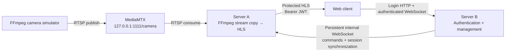

# Solution Architecture

## Overview

The system separates video handling from identity and management. A supervised camera process publishes one changing RTSP stream. Server A owns video ingestion, HLS generation, delivery authorization, and global video state. Server B owns users, authentication, sessions, browser commands, command logging, and the final static web client.



## Submission scope

The mandatory implementation comprises the RTSP camera simulator, MediaMTX, Server A's RTSP-to-HLS processing and independent authorization, Server B authentication/session/control services, persistent inter-server WebSocket protocol, final browser client, documentation, and recovery behavior. Bonus functionality is isolated to role-based command authorization and HMAC-chained audit-log integrity. Asymmetric encryption, C++/N-API, and TPM integration are not implemented and are not required by the mandatory solution.

## Component responsibilities

### Camera simulator

- Starts MediaMTX with RTSP/TCP on `127.0.0.1:1111`.
- Starts FFmpeg `testsrc2` at 640×480 and 30 fps.
- Publishes baseline H.264 to `/camera`, including a visibly changing elapsed counter.
- Supervises MediaMTX and FFmpeg independently with bounded restart delays.

### Server A — video server

- Reads the camera with FFmpeg over RTSP/TCP.
- Stream-copies H.264 into approximately one-second MPEG-TS HLS segments.
- Maintains a rolling six-segment playlist and deletes older generated segments.
- Independently verifies Bearer JWTs and synchronized active-session state.
- Applies a global `videoRunning` delivery gate.
- Handles control and session messages from the one authenticated Server B connection.

### Server B — authorization and management

- Reads bcrypt-hashed users from `users.json`.
- Issues one-hour HS256 JWTs and creates per-login in-memory sessions keyed by `jti`.
- Provides `POST /auth/login` and authenticated `GET /protected`.
- Serves the final browser client and `/docs`.
- Authenticates browser WebSocket upgrades and revalidates the session before each message.
- Enforces centralized role permissions before forwarding video commands.
- Forwards video commands to Server A and synchronizes active/revoked sessions.
- Serializes command-processing records into an HMAC-chained NDJSON `commands.log` and verifies the existing chain before startup.

### Browser client

- Presents login and operational views without a build system.
- Holds the password only for the active login request and the JWT only in JavaScript memory.
- Connects to Server B's WebSocket using the JWT and correlates requests by UUID.
- Uses hls.js so every playlist and segment request carries an Authorization header.
- Displays user/role, management and video state, responses, timeouts, and connection errors.
- Tears down all session and media state after logout, expiry, or Server B disconnection.

## Complete video flow

FFmpeg generates the changing test pattern and publishes H.264 to MediaMTX at the exact required RTSP URL. Server A's independently supervised FFmpeg reads that stream and performs container repackaging with `-c:v copy`; it does not re-encode. One-second target segments, 30-frame keyframes, a short hls.js live-sync distance, and a bounded playlist keep local delay near three seconds while avoiding excessive request overhead.

Server A protects the `/video/` subtree, not only the playlist. CORS accepts the configured `WEB_ORIGIN`, permits `GET`, `HEAD`, and `OPTIONS`, and allows the Authorization header. Preflight completes before authentication. Every real playlist or segment request must still pass synchronized-state, JWT, session, and delivery-state checks and receives `Cache-Control: no-store`.

## Authentication and authorization flow

1. The browser posts login/password to Server B over same-origin HTTP.
2. Server B compares the submitted password with the selected bcrypt hash.
3. A successful login creates a unique in-memory `jti` session and signs a one-hour HS256 JWT containing `sub`, `role`, `jti`, `iat`, and `exp`.
4. Server B sends `SESSION_ACTIVATE` when Server A is synchronized. Login still succeeds if Server A is unavailable; the next full snapshot will include the session.
5. The browser keeps the JWT only in memory, opens `/ws?token=…`, and starts hls.js.
6. Server A verifies the HS256 signature, expiry, required claim types, local active `jti`, and the equality of token `sub`/`role` with the synchronized record.

Server A never calls Server B through REST to authorize video. Independent verification avoids a per-segment network dependency and meets the assignment boundary.

## WebSocket control flow

The browser sends `{type, requestId, command}` over its authenticated Server B socket. Server B logs receipt, checks permissions derived from the verified session identity, forwards allowed video commands over its single persistent Server A socket, awaits the correlated response, logs the outcome, and returns a safe response with the browser's original `requestId`.

- `GET_STATUS` reads the global state.
- `STOP_VIDEO` changes the delivery flag to false.
- `START_VIDEO` changes it to true.
- `LOGOUT` is handled by Server B for the current browser session and synchronized to Server A.

Both client and internal requests have bounded pending maps and timeouts. The internal socket reconnects with bounded exponential backoff and rejects outstanding requests when disconnected. REST is never used between the servers.

## Bonus A: role-based access control

RBAC is implemented as a small central permission mapping. A `viewer` may view authenticated video, use `GET_STATUS`, and use `LOGOUT`. An `operator` may additionally use `START_VIDEO` and `STOP_VIDEO`; the `admin` user has this existing role rather than a special administrator role.

Server B enforces the mapping after message/session validation and before any call to the Server A forwarding client. Forbidden commands receive the normal correlated WebSocket response with `ok: false` and `error: "Forbidden"`, are logged with status `forbidden`, and leave the browser socket open. Unknown roles fail closed for management commands while retaining the universally available logout path. The frontend only displays a permission hint and is never trusted as the enforcement point.

## Bonus: HMAC command-log integrity

Each new NDJSON command record retains the readable fields `timestamp`, `user`, `message`, `requestId`, `status`, and optional `error`, then adds `previousHash` and `hash`. The first protected record uses the literal sentinel `GENESIS`. Every later `previousHash` is the preceding record's lowercase hexadecimal HMAC.

The canonical HMAC input is UTF-8 JSON constructed explicitly in this fixed property order:

```text
timestamp, user, message, requestId, status, error, previousHash
```

Absent `requestId` and `error` values are canonicalized as JSON `null`. The `hash` field is excluded. Server B computes `HMAC-SHA256(LOG_HMAC_SECRET, canonicalPayload)` and stores its 64-character lowercase hexadecimal result. Verification rejects malformed JSON, missing or unexpected fields, invalid hash encoding, a broken `previousHash` link, or an HMAC mismatch. Equal-length decoded HMAC values are compared with `crypto.timingSafeEqual`.

The logger's existing Promise chain now serializes the complete compute-and-append operation, so concurrent callers cannot read the same predecessor hash or interleave records. On startup, before Server B opens its HTTP listener, the logger parses and verifies every non-empty line. A missing or empty file starts at `GENESIS`; a valid file continues from its final verified hash; any invalid entry aborts startup with `Command log integrity verification failed` and nothing is appended.

The 507-entry development log created before this feature was renamed once to ignored `commands.pre-hmac.log`. A new `commands.log` starts at `GENESIS`; legacy entries were not assigned fake hashes and are explicitly not integrity protected.

Runtime audit failures propagate to command processing instead of being swallowed. Both the `received` and `forwarded` records must be appended before an allowed Server A command is invoked. If either append fails, Server B returns `Audit log unavailable` and does not forward the command. Login and health endpoints do not depend on runtime audit appends. If a final outcome append fails after an already-recorded action, the client receives the safe audit error; the action cannot be rolled back, but its receipt and forwarding remain in the chain.

## Session synchronization and logout

A signed JWT remains valid until expiration, so cryptography alone cannot implement immediate logout. Server A therefore maintains a local, in-memory authorization registry containing only `jti`, login, role, and expiration.

On every internal connection, Server B sends `SESSION_SYNC` with all active sessions and waits for acknowledgment. Server A atomically replaces its registry. Later logins send `SESSION_ACTIVATE`; logout sends `SESSION_REVOKE`. Duplicate activation and unknown revocation are harmless, expired sessions are excluded, and snapshot replacement removes absent records.

Server A starts unsynchronized. It clears the registry and fails HLS closed with HTTP 503 whenever the trusted channel disconnects or synchronization becomes uncertain. This prioritizes revocation safety over availability. A Server A restart recovers current sessions from Server B; a Server B restart produces an empty snapshot because its session store is in memory, invalidating all old JWTs.

On successful browser logout, Server B revokes the current `jti`, synchronizes the revocation when connected, replies, and closes that WebSocket. The browser destroys hls.js, stops and clears the video, clears its JWT and identity, rejects pending commands, and returns to login.

## START/STOP semantics

The phrase “stop video” is interpreted as stopping delivery rather than production because the assignment explicitly requires the source, FFmpeg, and related processes to continue running. The global `videoRunning` flag therefore sits after authorization and before static HLS serving:

- Authorized request while running: media is served.
- Authorized request while stopped: HTTP 503 `Video delivery is stopped`.
- Unauthorized request: HTTP 401 regardless of delivery state.
- Unsynchronized authorization state: HTTP 503 `Authorization state unavailable`.

The web client destroys playback after a successful stop and reinitializes hls.js after start. The FFmpeg PID and rolling segment output remain unchanged.

## Resilience and recovery

- Camera MediaMTX and FFmpeg processes restart independently after temporary failure.
- Server A's HLS FFmpeg restarts after unexpected failure and reconnects to the continuing RTSP source.
- Server B continues serving login and its browser WebSocket while Server A is offline; video commands return safe availability errors.
- Server B automatically reconnects to Server A and sends a full session snapshot before HLS authorization becomes available.
- The browser presents bounded video recovery attempts and also reinitializes playback after a successful `START_VIDEO` or running `GET_STATUS` result.
- A Server B outage closes the browser WebSocket. Because sessions were in that process, the client clears its token and requires a fresh login.

## Security decisions

- Passwords are stored only as bcrypt hashes.
- JWT verification is restricted to HS256 and checks required claims and active local session state.
- Development secrets live in ignored `.env`, never `users.json`, browser storage, URLs for HLS, or application logs.
- The command log uses a separate configured HMAC secret, verifies its full chain at startup, and fails command processing closed on append failure.
- HLS responses are non-cacheable and CORS is restricted to `WEB_ORIGIN`.
- Dynamic browser output uses `textContent`; user-controlled strings are not inserted with `innerHTML`.
- The internal socket uses a timing-safe shared-secret comparison and accepts one active management client.
- Message sizes, shapes, commands, identifiers, and session records are validated.
- Server B derives RBAC decisions from the verified JWT/session role and never accepts a client-supplied role.

For production, use HTTPS/WSS, preferably mTLS for service identity, asymmetric JWT signing or managed keys, rate limiting, durable distributed session/revocation state, and centralized protected audit logs.

## Ambiguities and chosen interpretations

- **Changing visual:** `testsrc2` supplies continuous visible motion and an elapsed counter without making the optional FFmpeg `drawtext` filter mandatory.
- **Stop behavior:** delivery is gated; generation is not interrupted.
- **Authorization:** an active synchronized `jti` is required in addition to a valid signature so logout is immediate.
- **Scope of video state:** the one-camera assignment maps to one global flag.
- **Roles:** the mandatory specification had no permission matrix; Bonus A defines viewer and operator permissions and is enforced at Server B.
- **WebSocket browser authentication:** the browser API cannot add an Authorization header, so the JWT participates as an upgrade query parameter. HLS never uses a token query parameter.
- **Service availability:** login is allowed while Server A is offline; video remains fail-closed until synchronization.

## Trade-offs and limitations

- HLS favors compatibility and simplicity over sub-second latency; observed local latency is roughly 2–4 seconds.
- Stream copy is efficient but relies on source keyframe cadence being appropriate for the target segment duration.
- Sessions and global state are not persistent or distributed.
- Server B restarts invalidate every login.
- HS256 gives both servers the signing secret; the internal channel uses another shared secret.
- The prototype is loopback HTTP/WS without TLS, refresh tokens, login throttling, or a database.
- JWTs appear in browser WebSocket query parameters, which can leak if infrastructure logs full URLs.
- HMAC chaining supplies tamper evidence rather than prevention. Anyone holding both the file and HMAC secret can recalculate it, and complete-file deletion is not detectable without an externally trusted checkpoint.
- Command logging lacks rotation or external durable storage; production should send audit records to centralized append-only/auditable storage.
- One camera, one Server A, and one Server B are assumed.
- Windows 11 x64 portability is designed and source-reviewed, but runtime testing was performed on macOS Apple Silicon.

## Cross-platform implementation

Runtime paths use `path.join` or `path.resolve`. External tools are configured through `FFMPEG_PATH` and `MEDIAMTX_PATH`. Child processes use `spawn(command, argumentArray, {shell: false, windowsHide: true})`, avoiding shell quoting, Unix separators, and executable suffix assumptions. Shutdown uses Node child-process methods instead of platform shell commands.

C++ is not used because it is only part of an optional bonus task and no mandatory requirement requires a native addon. The mandatory architecture remains entirely JavaScript.

## Optional improvements

Potential post-mandatory improvements include asymmetric or service-managed keys, mTLS, persistent/distributed sessions, refresh-token rotation, rate limiting, externally anchored audit integrity, multi-camera state, metrics, and automated Windows runtime validation. Bonus A RBAC and HMAC-chained audit integrity are implemented; asymmetric encryption, C++/N-API, and TPM work are deliberately excluded.
